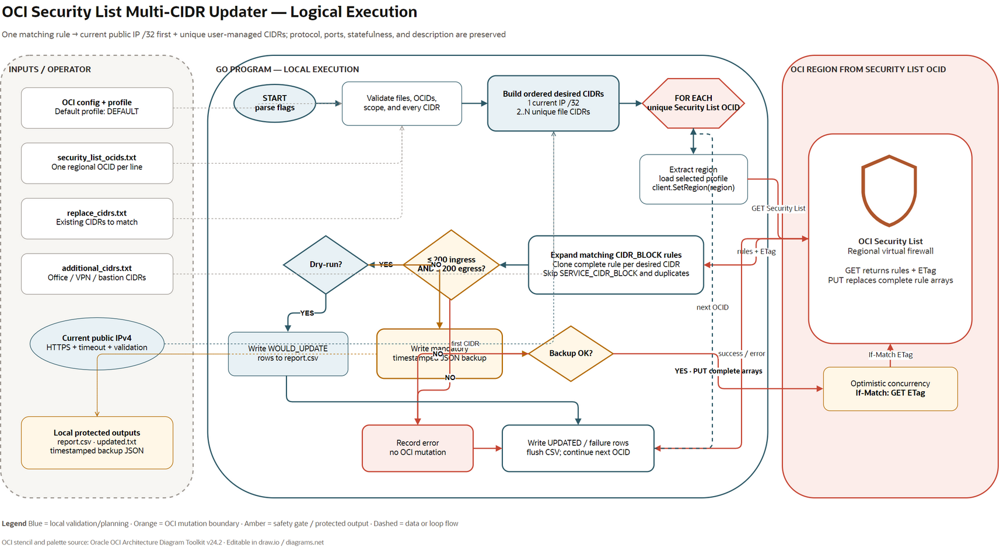

# OCI Security List Multi-CIDR Updater

This Go program safely expands matching Oracle Cloud Infrastructure (OCI) Security List rules into multiple equivalent CIDR rules.

The first replacement is the computer's current public IPv4 address as a `/32`. The remaining replacements come from `additional_cidrs.txt`, in file order. Duplicate CIDRs are removed while preserving that order.

> Important: an OCI Security List rule accepts only one source or destination CIDR. The program therefore **duplicates the complete matching rule once per desired CIDR**. Protocol, ports, ICMP options, stateless/stateful behavior, and description are preserved.

## Example

Suppose OCI contains this ingress rule:

| Direction | Source | Protocol | Destination port | Description |
|---|---|---|---:|---|
| Ingress | `0.0.0.0/0` | TCP | 22 | SSH administration |

The current public IP is `203.0.113.9`, and `additional_cidrs.txt` contains:

```text
192.0.2.0/24
198.51.100.10/32
```

The program replaces the one matching rule with:

| Order | Direction | Source | Protocol | Destination port | Description |
|---:|---|---|---|---:|---|
| 1 | Ingress | `203.0.113.9/32` | TCP | 22 | SSH administration |
| 2 | Ingress | `192.0.2.0/24` | TCP | 22 | SSH administration |
| 3 | Ingress | `198.51.100.10/32` | TCP | 22 | SSH administration |

The current public IP is always first when `--include-current-ip=true`, which is the default.

## Safety features

- Dry-run is enabled by default.
- CIDRs are parsed and normalized with Go's `net/netip` package before OCI is contacted.
- Only `CIDR_BLOCK` rules are modified. OCI `SERVICE_CIDR_BLOCK` rules are left unchanged.
- The OCI profile and target region are handled separately: the profile defaults to `DEFAULT`, while the client region is taken from each Security List OCID.
- Updates use the ETag returned by `GetSecurityList` as `If-Match`. OCI rejects an update if somebody changed the Security List after it was read.
- A mandatory JSON backup is written before each real update. If backup creation fails, the OCI update is not attempted.
- The planned result is rejected before update if it exceeds the OCI limit of 200 ingress or 200 egress rules per Security List.
- Existing equivalent rules and generated duplicates are not added again.
- HTTP calls used to discover the public IP have a timeout, require HTTPS, check the status code, and validate the result as IPv4.
- Operational failures produce a nonzero process exit code and are included in the CSV report.

OCI documents the current Security List rule limit as 200 ingress and 200 egress rules. See [OCI service limits](https://docs.oracle.com/en-us/iaas/Content/General/service-limits/default.htm). OCI recommends Network Security Groups for many newer designs; see [OCI Security Lists](https://docs.oracle.com/en-us/iaas/Content/Network/Concepts/securitylists.htm).

## Project files

```text
.
├── main.go                         Program
├── main_test.go                    Unit tests for expansion and safety logic
├── go.mod / go.sum                 Go module definition and checksums
├── security_list_ocids.txt         Security List OCIDs to process
├── replace_cidrs.txt               Existing CIDRs whose rules should be expanded
├── additional_cidrs.txt            User-managed replacement CIDRs
├── docs/
│   └── execution-flow.drawio       Editable logical execution diagram
├── backups/                        Created at runtime before real updates
├── report.csv                      Created at runtime
└── updated.txt                     Detected current public CIDR
```

## Requirements

- Go 1.21 or later.
- An OCI account and an API-signing-key configuration.
- Permission to read and update the specified Security Lists.
- Outbound HTTPS access to the OCI API endpoints and, when enabled, `https://api.ipify.org`.

A typical OCI CLI-style configuration looks like this:

```ini
[DEFAULT]
user=ocid1.user.oc1..example
fingerprint=aa:bb:cc:dd:example
tenancy=ocid1.tenancy.oc1..example
region=eu-frankfurt-1
key_file=C:\secure\oci_api_key.pem
```

The configured region is only the initial SDK region. The program explicitly selects the region embedded in each Security List OCID, so one OCID file can contain regional resources from multiple regions.

An IAM administrator must grant an appropriately scoped policy. The exact policy depends on your tenancy structure and whether a group or dynamic group runs the tool. Review the policy with your OCI administrator and follow least privilege.

## Build and test

From this directory:

```powershell
go mod download
go test ./...
go vet ./...
go build -o oci-security-list-multi-cidr-updater.exe .
```

Linux or macOS:

```bash
go mod download
go test ./...
go vet ./...
go build -o oci-security-list-multi-cidr-updater .
```

You can also use `go run .` in the examples below.

## Configure the input files

### `security_list_ocids.txt`

Add one Security List OCID per line:

```text
# Production administration lists
ocid1.securitylist.oc1.eu-frankfurt-1.aaaa...
ocid1.securitylist.oc1.uk-london-1.bbbb...
```

Blank lines and lines beginning with `#` are ignored. Duplicate OCIDs are processed once.

### `replace_cidrs.txt`

Add every existing CIDR that should trigger rule expansion:

```text
# Replace broad historical administration sources
0.0.0.0/0
10.40.0.0/16
```

Matching is semantic after network normalization. For example, `10.40.1.10/16` is normalized to `10.40.0.0/16`.

Only exact normalized CIDRs match. The program does not treat a subnet as matching merely because it is contained by another prefix.

### `additional_cidrs.txt`

Add the additional sources or destinations that should be allowed:

```text
# Corporate office
192.0.2.0/24

# VPN gateway
198.51.100.10/32

# IPv6 administration network is also accepted
2001:db8:1234::/48
```

When current-IP discovery is enabled, the effective ordered list is:

```text
1. detected-current-public-ip/32
2. first unique CIDR from additional_cidrs.txt
3. second unique CIDR from additional_cidrs.txt
...
```

## Recommended operating procedure

### 1. Preview the change

```powershell
go run . `
  --update=ingress `
  --ocid-file=security_list_ocids.txt `
  --replace-cidr-file=replace_cidrs.txt `
  --additional-cidr-file=additional_cidrs.txt `
  --dry-run=true
```

Review `report.csv`. No OCI update and no backup are produced during a dry-run. `updated.txt` is still written because it records the detected input value.

### 2. Apply the reviewed change

```powershell
go run . `
  --update=ingress `
  --ocid-file=security_list_ocids.txt `
  --replace-cidr-file=replace_cidrs.txt `
  --additional-cidr-file=additional_cidrs.txt `
  --dry-run=false
```

Before every actual update, a timestamped JSON file is written to `backups/`. Keep this directory protected because it describes network access rules.

### 3. Confirm the result

Inspect the Security List in the OCI Console or with the OCI CLI. Also review `report.csv` and archive it according to your change-management process.

## Common command variants

### Update ingress and egress

```powershell
go run . --update=both --dry-run=true
```

Ingress `Source` and egress `Destination` values are handled independently, but they use the same target and replacement CIDR files.

### Use only manually supplied CIDRs

```powershell
go run . --include-current-ip=false --dry-run=true
```

At least one valid CIDR must then exist in `additional_cidrs.txt`.

### Expand every ordinary ingress CIDR rule

```powershell
go run . --update=ingress --replace-all-ingress --dry-run=true
```

This is intentionally broad. It expands every ingress rule whose source type is empty/default or `CIDR_BLOCK`. It never changes `SERVICE_CIDR_BLOCK` rules. Always preview and check the projected rule count.

### Use a non-default OCI profile

```powershell
go run . --profile=NETWORK-ADMIN --dry-run=true
```

### Use a different OCI config file

```powershell
go run . --config=C:\secure\oci\config --profile=DEFAULT --dry-run=true
```

## Restore a backup

Restore is a separate, explicit operation. It does not run automatically at the end of an update.

First preview:

```powershell
go run . --restore-backup=backups\security-list-example-20260722T120000Z.json --dry-run=true
```

Then apply after reviewing the snapshot:

```powershell
go run . --restore-backup=backups\security-list-example-20260722T120000Z.json --dry-run=false
```

Restore first reads the current Security List and sends its current ETag with `If-Match`. This prevents the restore request from silently overwriting a change made between the restore's read and write operations. A restore deliberately replaces the complete ingress and egress rule collections with the snapshot.

Immediately before applying the restore, the program also writes a new snapshot of the current rules. If that mandatory pre-restore backup cannot be created, the restore is not attempted.

## Command-line flags

| Flag | Default | Meaning |
|---|---|---|
| `--ocid-file` | `security_list_ocids.txt` | Security List OCIDs to process |
| `--replace-cidr-file` | `replace_cidrs.txt` | Existing CIDRs to match |
| `--additional-cidr-file` | `additional_cidrs.txt` | User-managed replacement CIDRs |
| `--include-current-ip` | `true` | Insert detected public IPv4 `/32` first |
| `--public-ip-url` | `https://api.ipify.org` | HTTPS current-IP endpoint |
| `--updated-file` | `updated.txt` | Detected current CIDR output |
| `--update` | `both` | `ingress`, `egress`, or `both` |
| `--replace-all-ingress` | `false` | Expand all ordinary ingress CIDR rules |
| `--dry-run` | `true` | Preview without OCI changes |
| `--config` | `~/.oci/config` | OCI configuration file |
| `--profile` | `DEFAULT` | OCI configuration profile |
| `--report-file` | `report.csv` | CSV audit report |
| `--backup-dir` | `backups` | Mandatory pre-update snapshots |
| `--restore-backup` | empty | Restore one JSON snapshot instead of replacing CIDRs |
| `--http-timeout` | `10s` | Current-IP request timeout |
| `--request-timeout` | `45s` | Timeout for one Security List request sequence |

Run `go run . --help` for the generated command reference.

## CSV statuses

| Status | Meaning |
|---|---|
| `WOULD_UPDATE` | Dry-run planned a new rule or removal |
| `UPDATED` | OCI accepted the ETag-protected update |
| `ALREADY_PRESENT` | An equivalent rule already exists, so no duplicate was generated |
| `NO_CHANGES` | No matching rule changed the resulting collection |
| `LIMIT_EXCEEDED` | Planned ingress or egress count exceeded 200 |
| `BACKUP_FAILED` | Mandatory snapshot could not be written; OCI was not updated |
| `UPDATE_FAILED` | OCI rejected or could not perform the update |
| `GET_FAILED` | Security List retrieval failed |
| `CLIENT_ERROR` | OCI configuration or client construction failed |
| `INVALID_OCID` | Input was not a regional Security List OCID |

`RuleIndex` is the zero-based index in the Security List returned by OCI. Non-rule errors use `-1`.

## Matching and idempotence details

- Every field other than source/destination is copied from the matched rule.
- The result order for newly generated rules follows the effective replacement CIDR order.
- Duplicate entries in `additional_cidrs.txt` are ignored.
- If an equivalent rule already exists, it is reused rather than duplicated.
- If the original target CIDR is also included in the replacement file, rerunning the tool does not continually multiply equivalent rules.
- Multiple target CIDRs are supported. Every matching rule is independently expanded.
- Existing duplicate rules that are unrelated to a selected target are preserved; the program avoids broad cleanup outside the requested operation.

## Exit codes

| Code | Meaning |
|---:|---|
| `0` | All requested Security Lists completed successfully |
| `1` | Input, network, OCI, report, backup, or restore failure |
| `2` | Invalid command-line usage |
| `130` | Interrupted with Ctrl+C or termination signal |

The program continues to later OCIDs when one Security List fails, then returns exit code `1` if any failed.

## Security considerations

- Start with dry-run and inspect the planned rule count and sources.
- Avoid putting `0.0.0.0/0` or `::/0` in `additional_cidrs.txt` unless unrestricted access is intentional.
- Treat OCI API private keys and backup JSON files as sensitive.
- Do not store confidential information in OCI rule descriptions.
- Consider whether an OCI Network Security Group is a better long-term control for workload-specific access.
- Keep the OCI configuration profile least-privileged and scope IAM policy to the required compartment.
- Retain the CSV and backup together when formal change-management evidence is required.

## Execution diagram

[](docs/execution-flow.drawio)

Click the diagram to open or download the editable [`docs/execution-flow.drawio`](docs/execution-flow.drawio) source. It uses the official Oracle OCI diagram color palette and an OCI Security List stencil sourced from Oracle's OCI Architecture Diagram Toolkit v24.2.

Oracle publishes the toolkit in draw.io, PowerPoint, and Visio formats: [OCI Architecture Diagram Toolkits](https://docs.oracle.com/en-us/iaas/Content/General/Reference/graphicsfordiagrams.htm).

## Troubleshooting

### `load OCI profile "DEFAULT"`

Confirm that the config path exists, the profile header matches `--profile`, and `key_file` points to a readable private key.

### `412 Precondition Failed`

The ETag changed after the program read the Security List. Someone or something updated it concurrently. Rerun dry-run against the new state; do not bypass the protection.

### `LIMIT_EXCEEDED`

One matching rule becomes one rule per desired CIDR. Reduce the replacement list, narrow the target rules, split controls across permitted Security Lists, or reconsider the design with Network Security Groups.

### No rules changed

Check the following:

1. The target is present in `replace_cidrs.txt`.
2. The OCI rule uses `CIDR_BLOCK`, not `SERVICE_CIDR_BLOCK`.
3. The selected direction matches `--update`.
4. The normalized rule CIDR exactly equals the normalized target.
5. The equivalent desired rules do not already exist.

### Current public IP lookup fails

Verify outbound HTTPS and proxy configuration. If current-IP discovery is not required, use `--include-current-ip=false` and provide all desired CIDRs in `additional_cidrs.txt`.
